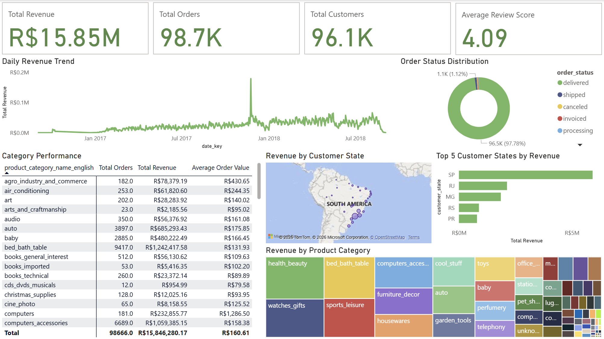
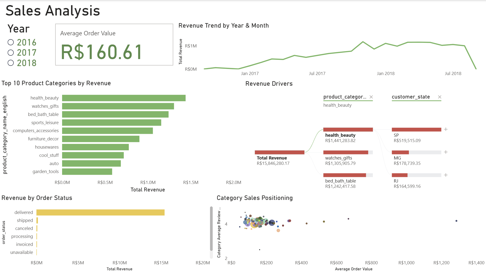
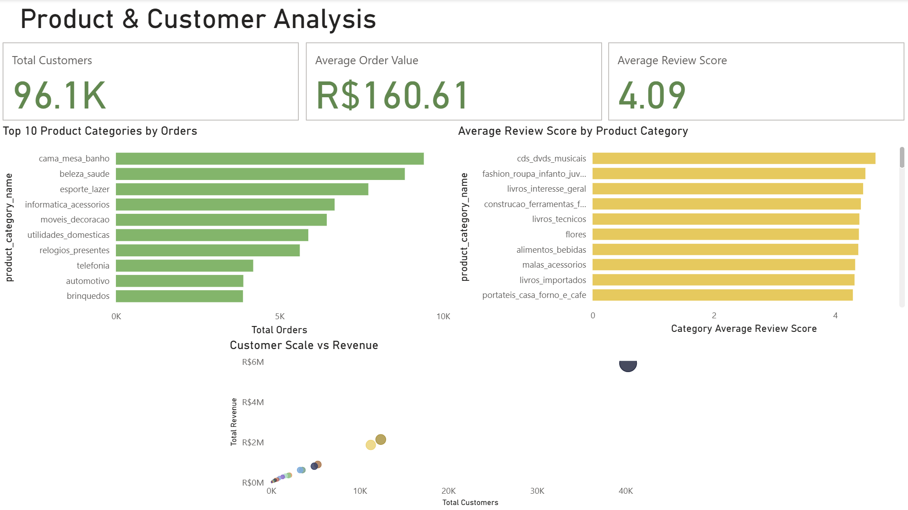
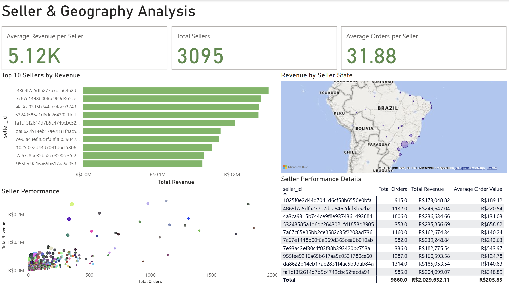

# Olist E-Commerce Analytics

An end-to-end e-commerce analytics project built to explore sales, customer, product, and seller performance using the Olist Brazilian E-Commerce dataset.

The project combines data preparation, relational data modeling, SQL analysis, DAX measures, and interactive Power BI dashboards to transform raw transactional data into actionable business insights.

---

## Project Overview

E-commerce businesses generate large volumes of transactional data across customers, products, orders, payments, reviews, and sellers.

The goal of this project is to transform that data into an interactive analytical solution that helps answer key business questions related to:

- Sales and revenue performance
- Order status distribution
- Product category performance
- Customer distribution
- Customer spending behavior
- Seller performance
- Geographic revenue distribution

---

## Business Questions

This project focuses on several core questions:

1. How does revenue change over time?
2. Which product categories generate the most orders and revenue?
3. Which customer states contribute the most revenue?
4. How does customer scale relate to revenue?
5. Which sellers generate the highest revenue?
6. How is seller performance distributed geographically?
7. How does customer and product review performance vary across categories?

---

## Dashboard

The final Power BI report contains four analytical pages.

### 01 — Executive Overview

Provides a high-level view of overall business performance, including:

- Total revenue
- Total orders
- Total customers
- Average review score
- Daily revenue trend
- Order status distribution
- Revenue by customer state
- Top customer states by revenue
- Product category revenue distribution
- Category performance details



---

### 02 — Sales Analysis

Focuses on sales trends and revenue drivers.

Key visuals include:

- Revenue trend by year and month
- Top 10 product categories by revenue
- Revenue by order status
- Category sales positioning
- Revenue drivers using a decomposition tree



---

### 03 — Product & Customer Analysis

Explores product category performance and customer scale.

Key visuals include:

- Top 10 product categories by orders
- Average review score by product category
- Customer scale vs. revenue
- Customer and order performance indicators



---

### 04 — Seller & Geography Analysis

Focuses on seller performance and geographic distribution.

Key visuals include:

- Total sellers
- Average revenue per seller
- Average orders per seller
- Top 10 sellers by revenue
- Seller performance
- Revenue by seller state
- Seller performance details



---

## Key Insights

The dashboard highlights several notable patterns in the Olist marketplace:

- Revenue is highly concentrated in a small number of customer states, with São Paulo contributing a substantial share.
- The majority of orders are in the delivered status.
- A relatively small group of product categories contributes a significant portion of total revenue and orders.
- Customer volume and revenue show a strong positive relationship across states.
- Seller revenue is also concentrated among a smaller group of high-performing sellers.
- Product categories can differ substantially in average order value and review performance.

> Detailed quantitative insights can be explored directly through the interactive Power BI dashboard.

---

## Tools & Technologies

### Data & Database
- PostgreSQL
- SQL
- Relational data modeling

### Analytics
- Power BI
- DAX
- Data transformation
- Data exploration

### Visualization
- Power BI interactive dashboards
- Data storytelling
- Geographic visualization
- Decomposition tree
- Scatter plot
- Matrix
- Treemap
- Donut chart

---

## Repository Structure

```text
olist-ecommerce-analytics/
│
├── powerbi/
│   ├── Olist_Ecommerce.pbix
│   └── README.md
│
├── screenshots/
│   ├── executive-overview.png
│   ├── sales-analysis.png
│   ├── sales-analysis-2016.png
│   ├── sales-analysis-2017.png
│   ├── sales-analysis-2018.png
│   ├── product-customer-analysis.png
│   └── seller-geography-analysis.png
│
└── README.md
```

---

## Dataset

This project uses the Olist Brazilian E-Commerce dataset.

The dataset contains information related to orders, customers, products, sellers, payments, reviews, and geographic data.

The dataset is a third-party resource and remains subject to its original terms and attribution requirements.

---

## How to Explore the Project

### Power BI

Download the Power BI report from:

`powerbi/Olist_Ecommerce.pbix`

Open the file using Power BI Desktop.

### Dashboard Screenshots

Static previews of the dashboard are available in the `screenshots/` directory.

---

## Project Status

1. Data preparation
2. Data modeling
3. DAX measures
4. Dashboard development
5. Dashboard refinement
6. Documentation

---

## Author

**Fiko Yorisdwi 'Aliy**

Informatics Student  
Interested in Data Analytics, Data Visualization, and Machine Learning.

---

##  License

This project is licensed under the MIT License.

See the [LICENSE](LICENSE) file for details.

---

##  Disclaimer

This repository is intended for educational and portfolio purposes.

Third-party datasets, trademarks, and external resources remain the property of their respective owners and are not relicensed by this repository.
